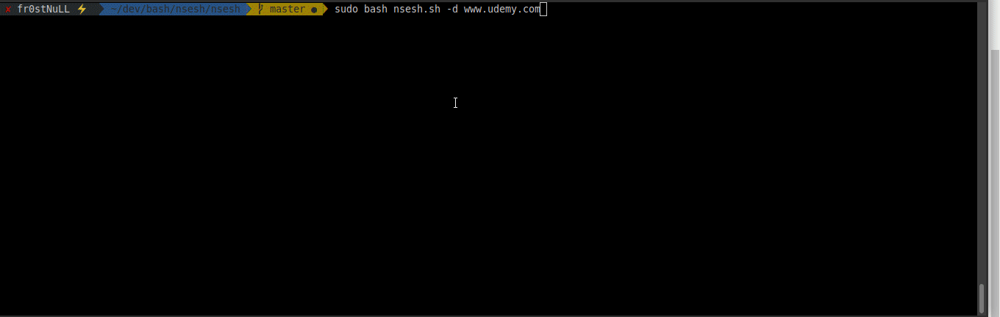

# nsesh
small Bash script to RECON a domain with NSE scripts for penetration testing.



## NSE-SCRIPTS
* dns-brute
* http-enum & http-title
* Vulscan & vulners
* banner-plus

## Dependencies
* nmap **sudo apt install nmap**
* vulnscan & vulners scricpt & banner-plus

## install script
./install.sh

###### install vulners & vulscan
```
# banner plus install
wget https://raw.githubusercontent.com/hdm/scan-tools/master/nse/banner-plus.nse
cp banner-plus.nse /usr/share/nmap/scripts/

# Vulners install
wget https://raw.githubusercontent.com/vulnersCom/nmap-vulners/master/vulners.nse

# vulscan install
git clone https://github.com/scipag/vulscan
ln -s `pwd`/vulscan /usr/share/nmap/scripts/vulscan

```

## Contributions
This package was developed in my free time. However, contributions from everybody in the community are welcome, to make it a better web scraper. If you think there should be a particular feature or function included in the package, feel free to open up a new issue or pull request.

## TODO 
* XML output parser
* HTML report
* more *QUICK* NSE SCRIPTS
